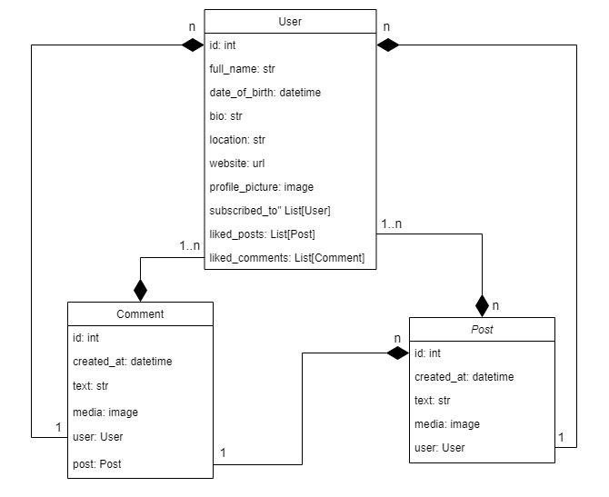

# Social media API

Service for making posts with images, following other users, liking and commenting their posts.

## Installation

Python3 and Docker must be already installed.

```shell
git clone -b develop https://github.com/vlodek69/social-media-api
cd social-media-api
python -m venv venv
venv\Scripts\activate (on Windows)
source venv/bin/activate (on macOS)
```

Copy .env-sample -> .env and populate with all required data.

```shell
docker-compose up --build -d
```

## How to use

Once the server is up and running, create superuser:

- First execute an interactive Bash shell on the app's container
```shell
doker exec -it <container_name> bash
```

- Then create superuser in the shell
```shell
python manage.py createsuperuser
```

See the documentation on `/api/doc/swagger/` endpoint.

## Features:
- User if able to register with their email, password, username and date of birth.
- Authentication implemented using JWT. Ability to logout and invalidate their token.
- Users are able to update their profile and add information like a profile picture, location, bio, website link.
- Users are able to create posts with text and image, like and comment posts.
- Posts can be updated only for 5 minutes after posting. Posts still can be deleted any time.
- Can create scheduled posts. Scheduling implemented using Celery.
- Users are able to subscribe to other users.
- Filtering users by username, full name and location.
- Retrieving only liked posts or subscription feed.
- Swagger UI documentation.

## Diagram


